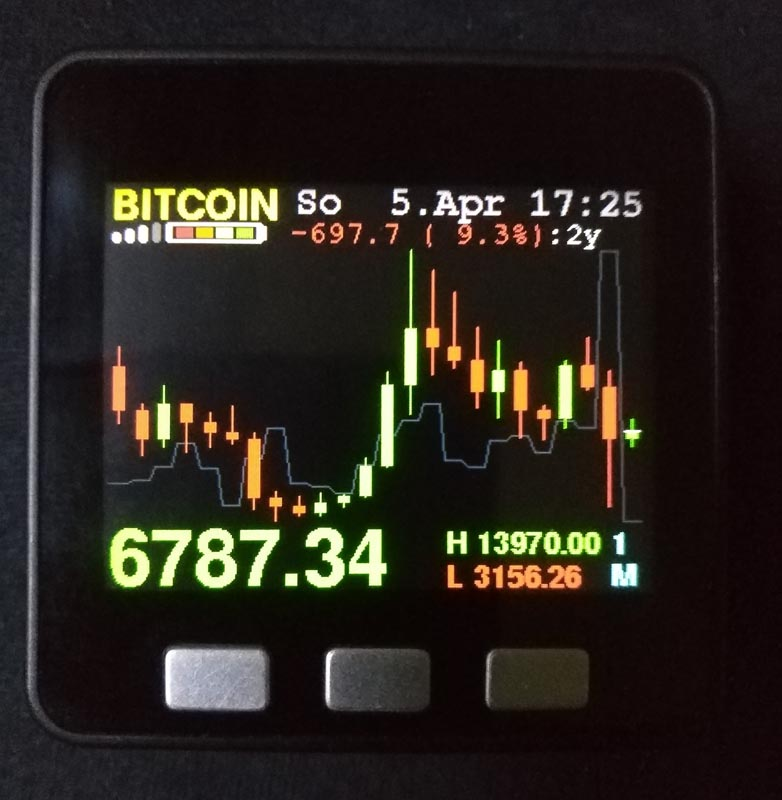
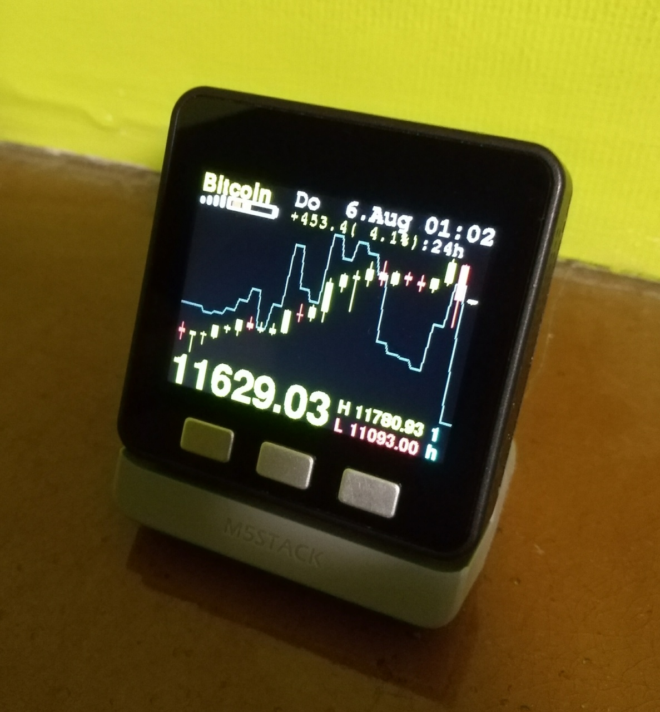
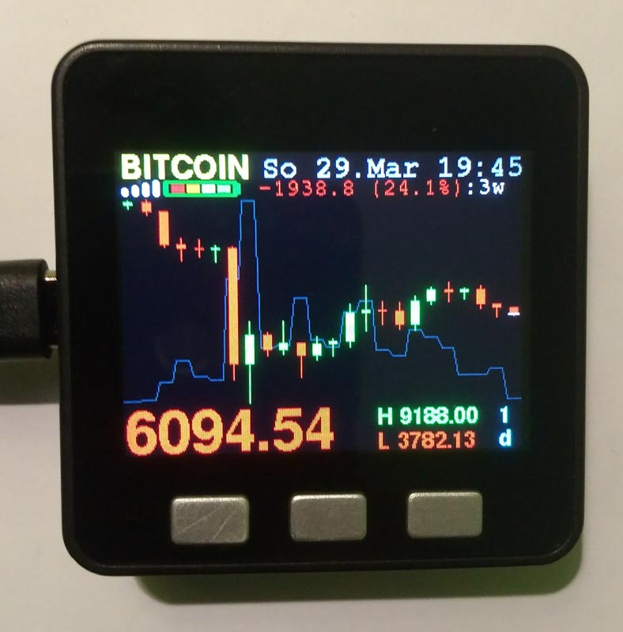
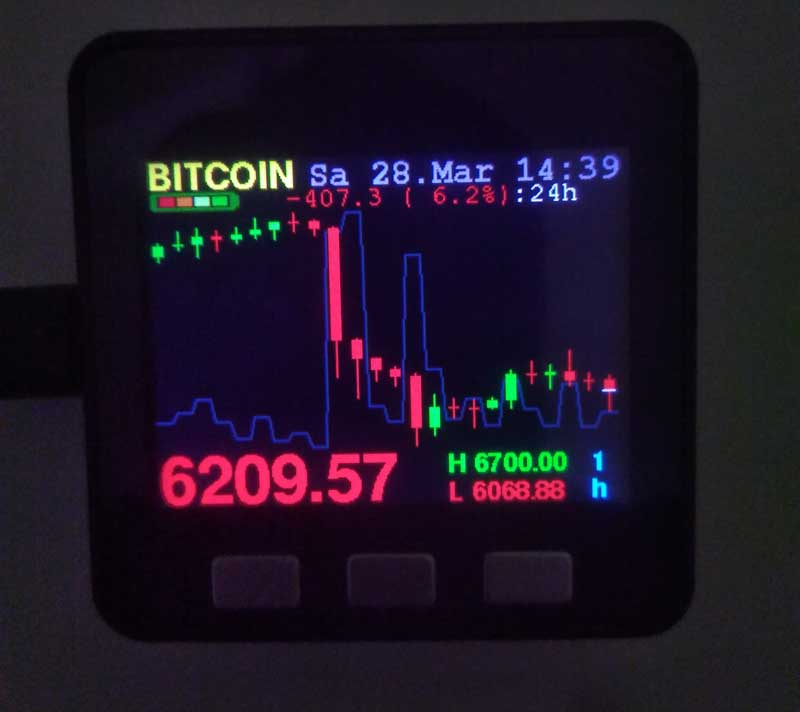
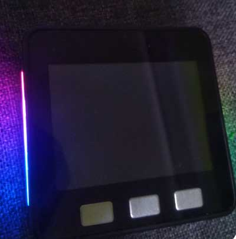
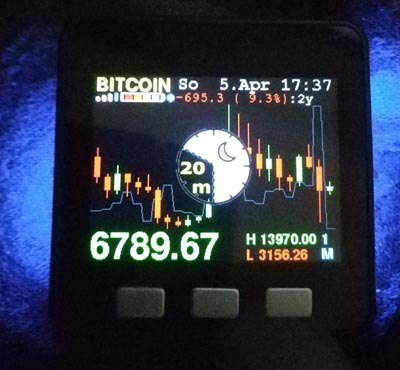
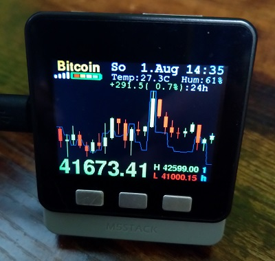

Multi Crypto Coin Price Ticker with candlestick chart

#SD-Card Version with configuation file#  (updated version)

only needs config file "ccticker.cfg" on SD-Card

This will show a 24 candles, the min/max price and the volume as line, date and time are from time.nist.gov timeserver.
For M5-Stack MCU , coded in ArduinoIDE 1.8.13 - last modified Aug.01.2021 12:27 CET - Version 1.0.5 using spiffs + SDconfig

**last edit:** added optional support for the SHT30 Temperature and Humidity sensor in the official grey vertical base - makes a bit larger info panel so only select if you want it.  -> when using the M5Burner just select regular or the sensor version (Celcius or Fahrenheit)
For regular users **without the vertical base** i recommend to use the **usual version** because you would loose some pixels from the candle chart for no benefit.

--------> **NOTE:** I discovered a **bug** that the current used settings are not loaded to internal memory or are not loaded back correclty. After a restart it always shows BTC and 1 hour timeframe. Usually everythin (currency/timeframe/brightness) should be saved automatically.
I will fix this issue soon i hope. sorry

##Using the App:

- This version needs a SD-Card whith the your WiFi credentials, favourite coinpairs, timezone and language(eng/ger/esp) in a textfile - see installation

- ButtonA: switches through your favourite Coinpair (as many you want) e.g: BTC/USDT etc. which are available on Binance.com

- ButtonB: changes the LCD-Brightness in 4 levels

- ButtonC: 9 changeable Timeframes from 1 Minute to 1 Month

- turn OFF the device pressing the red button once OR by holding ButtonC for over 1 second if USB is connected

- Press buttonC, then, within 2 sec press buttonA to switch down, or buttonB to switch up through the timeframes: 1min->15mins->1hour->..

- available timeframes are 1minute, 3m, 5m, 15m, 1h, 4h, 1d, 1w, 1Month

- if you hold ButtonC at Startup: it will start with alternative SSID2/WiFi2-password instead (e.g your mobile phone's hotspot)

##Further description:

- The top infoPanel shows the WiFi-strength, batterylevel, colored indicators for "busy", SleepTimer, price moving and if charging from usb (can have delay up to 30s)

- right now: english, german, spanish (day and month names)

- SleepTimer: when holding ButtonB longer than 1,5 seconds it will start a user defined timer to powerOFF the device

- If WiFi is failing more than 2 minutes it reduces the reconnect interval and brightness level, after 10 minutes -> shutdown device

- SDMenu Loader compatible, if SD-Updater (menu.bin) is installed in your SD- Card hold buttonA while booting up to start MenuLoader to load your apps

- It is prepared for the use of a Neopixel RGB-LED bar (i use the built-in one in the Battery-Bottom Module for M5Stack/Fire with rgb 10 LEDs)

- The settings will remain stored in internal memory after a reset. No SD-Card is needed after you have loaded your settings once! (thats new!)

- If no SD-Card is installed it will try to load these settings again.

- If you want to clear all stored settings from internal memory hold ButtonB at start-up

SEE CODE FOR FURTHER INSTRUCTIONS ABOUT THE SD-CARD DATA FOLDER AND CONFIG FILE

M5-Stack-Community-Forum: https://community.m5stack.com/topic/1801/bitcoin-multi-crypto-coin-ticker-with-24-candlesticks-chart

## -- THIS IS ALL FREE - if you love it please support me with any crypto tokens  -- ##
    -> bc1qvfjd0x2r7fk3p0lwwaxvjjzgdrgjnu5fhqjqcv               (Bitcoin/BTC - native segwit)
    -> 0x8D88c8ff9A467F0821E8d1941D206164b11F4056               (Ethereum/ETH - or any ERC20 or BSC/BEP20 tokens)
    -> D5QEBVqY3B9kUEMn9nRHexSbMaRgRafKiY                       (Doge/DOGE)
    -> THRo4ujdmD5eYVPD2XUodN7NowRZ88F9rN                       (Tron/TRX or any TRC10/TRC20 tokens)
    -> GDY2LAUPJFWCR4XWN5EHQ72VLYRY53CNCCA4IXTBBZBKMAGT2BSY7KUT (Stellar/XLM)

