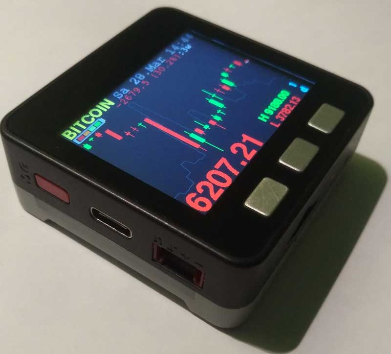

 Crypto Currency Ticker for M5Stack. Getting data over WiFi from Binance API/Websocket_v3 

 This code is forked from the original code: https://github/goleh/bitcoin-ticker  for SPI TFT display ILI9341 and NodeMCU Board, 18.dec.2019 BUT Meanwhile i cannot find his project site and user on github but credits go to him and his code which builds the core of my project.

 this version is MODIFIED by frittna to use on M5-Stack with ArduinoIDE - created 22.Mar.2020 22:07 CET
 
FEATURES:

shows 24 candles, min/max prize and volume as line, date and time (time.nist.gov timeserver)

buttonA: switches through 8 (as many you want) preconfigured pairs e.g: BTC to USDT etc. which are available on Binance.com

buttonB: changes the LCD-Brightness in 4 levels

buttonC: 9 changeable Timeframes from 1 Minute to 1 Month,
press buttonC, then, within 2 sec press buttonA to switch down or buttonB to switch up through the timeframes
 available timeframes are 1m, 3m, 5m, 15m, 1h, 4h, 1d, 1w, 1M
 
now using free fonts, changed output format for small and very small currencies, added the use of SPIFFS for some icons
 
settings will remain stored after a reset
 
hold ButtonC at Startup: will start with alternative SSID/WiFi-password instead (e.g your mobile phone's hotspot)
 
the new infoPanel shows: batterylevel and indicates charging (can have delay up to 30s), a colored "busy" light, sleeptimer-
 
SleepTimer: when holding ButtonB longer than 2 seconds it will start a 20 minutes timer to powerOFF the device

if WiFi is failing more than 2 minutes it reduces the reconnect interval and brightness level, after 10 minutes -> shutdown device

prepared for the use of a Neopixel RGB-LED bar (i use the built-in one in the Battery-Bottom Module for M5Stack/Fire with rgb 10 LEDs)

Menu Loader compatible, if SD-Updater (menu.bin) is installed in your SD-card hold buttonA while booting up to start MenuLoader to load your apps

-> the impoovements are based on quick and dirty solutions - no complains please ;) your changings are welcome !!! :)
 known bugs: ButtonC needs better debouncing, slow response if wifi signal receiption is not stable, maybe more bugs but in general it is working fine

