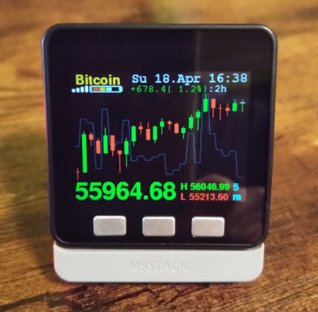

 
Crypto Currency Ticker with 24 candlesticks chart for M5Stack - receiving WiFi data from Binance API/Websocket_v3 
Bitcoin, Ethereum, Litecoin, etc... show the currency you want from Binanace

the Ticker shows a 24 candles chart, LO/HI values, volume as line and date and time (time.nist.gov timeserver), price is reloading every 2 seconds

This app is a for the M5-Stack with ArduinoIDE. last modified 04.Aug.2020 21:25 CET - Version 1.0.1

The code is forked from a project which draws candles, min and max, price and date on an ILI9341 TFT diplay with NodeMCU Board, from 18.dec.2019, credits go to him and his code which builds the core of my project. https://github.com/olbed/bitcoin-ticker

ADDED FEATURES:

-buttonA: switches through 8 (as many you want) preconfigured pairs e.g: BTC to USDT etc. which are available on Binance.com

-buttonB: changes the LCD-brightness in 4 levels

-buttonC: 9 changeable Timeframes from 1 minute to 1month per candle, press buttonC, then within 2 sec press buttonA to switch down or buttonB to switch up through the timeframes, available timeframes at the moment: 1m, 3m, 5m, 15m, 1h, 4h, 1d, 1w, 1M

-the new infoPanel shows: WiFi-strenght, batterylevel and indicates charging (can have delay up to 30s), a colored "busy" light, sleeptimer indicator

-now using free fonts, changed output format for small and very small currencies, added the use of SPIFFS for some icons

-settings will remain stored after a reset

-hold ButtonC at startup: will start with alternative SSID/WiFi-password instead (e.g your mobile phone's hotspot)

-SleepTimer: holding ButtonB long will start a 45 minutes timer to powerOFF the device, same for disabling the timer.

-ButtonC long pressed turns OFF the device (when on usb power there is no option to turn off the unit except by a PowerOFF command)

-if WiFi is failing more than 2 minutes it reduces the reconnect interval and brightness level, after 10 minutes with no signal shutdown device

-prepared for the use of a Neopixel RGB-LED bar (i use the built-in one in the Battery-Bottom Module for M5Stack/Fire with 10xRGB LEDs) it will only light up in rainbow colors at startup, no use in main loop right now

-sd-card Menu Loader compatible, if SD-Updater (menu.bin) is installed in your SD-card hold buttonA while booting up to start MenuLoader to load your apps

-> the impovements are made with quick and primitive solutions - no complains please ;) your changings are welcome !!! :) known bugs: ButtonC needs better debouncing, slow response if wifi signal receiption is not stable, maybe there are a few more minor unknown bugs but in general it is working very good atm.

! SEE CODE FOR FURTHER INSTRUCTIONS !

if you like white background? (just for fun, i will not update this version in future)
